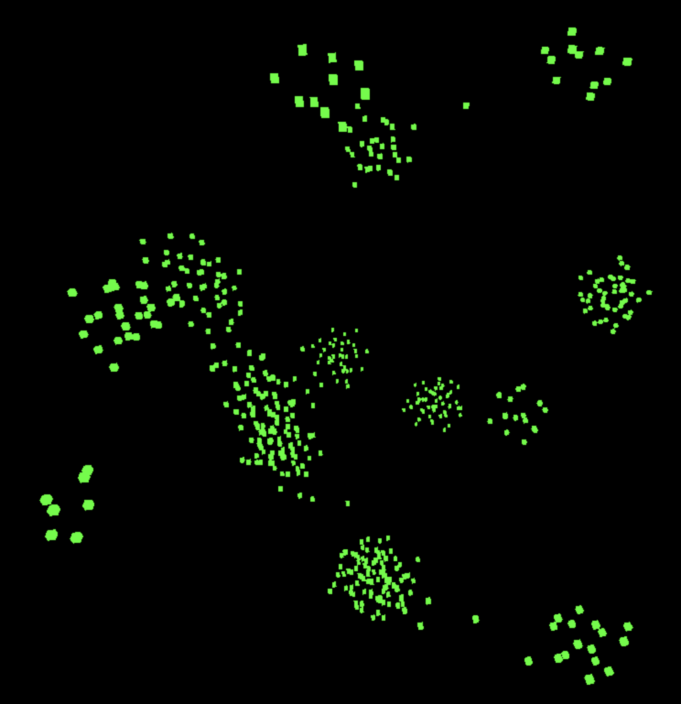

# boids
In-browser playground for swarm intelligence.

## Instructions / Controls
- Use DRAG controls to orbit around the center and ZOOM into the cute lil' flocks that form over time.
- DOUBLE CLICK for mobile users, and RIGHT-SHIFT for desktop users to pause/resume the simulation.
- SPACE to move the boids closer to the origin
- LEFT-SHIFT to move the boids away from the origin
- C to hide/show physics constants table

## Development
0. `git clone` this repository
1. `npm install` the things
2. Run tests w/ ts-lint: `npm run test`
3. Run development on port 8081: `npm run dev`
4. Make mistakes. `code .`
5. Go to 2.
